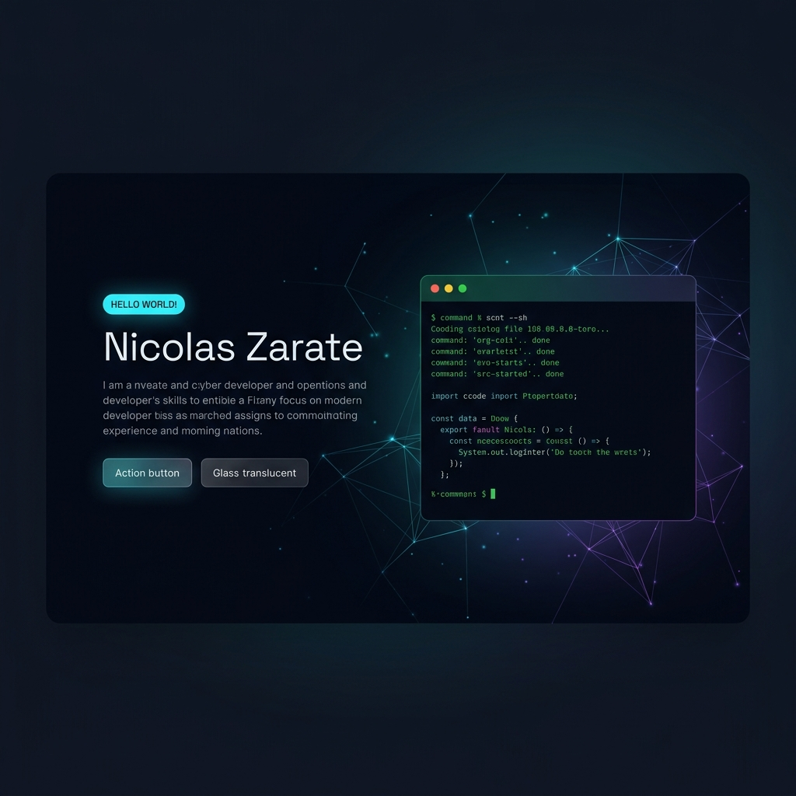

# Nicolás Zárate — Interactive Developer Portfolio

<p align="center">
  
</p>

<h2 align="center">Cyber-Themed Interactive Portfolio Site</h2>

<p align="center">
  A high-performance, dark-themed developer portfolio inspired by command-line interfaces and futuristic cyber aesthetics. Features an interactive in-browser terminal emulator, custom particles system, multi-language support (EN/ES), glassmorphism design layouts, and secure spam-prevention contact forms.
</p>

<p align="center">
  <a href="https://www.nicolaszarate.com/" target="_blank">
    
  </a>
  <a href="https://github.com/Nicolanz/Portfolio" target="_blank">
    
  </a>
</p>

<p align="center">
  <a href="#"></a>
  <a href="#"></a>
  <a href="#"></a>
  <a href="#"></a>
  <a href="#"></a>
  <a href="#"></a>
  <a href="#"></a>
</p>

---

## 📸 Preview

<p align="center">
  
</p>

---

## ⚡ Core Features

- 🖥️ **Interactive Terminal Emulator:** Built completely in vanilla JavaScript. Users can type Unix-like commands to explore professional profiles, tech stacks, projects, and download the resume. It includes:
  - Auto-scrolling response blocks.
  - Quick-shortcut buttons for terminal novices.
  - **Secret Commands:** Enter `secret` or `matrix` to trigger a full-screen retro green Matrix digital rain fall.
- 🌐 **Seamless Multi-Language Support (EN/ES):** High-fidelity translated versions (`index.html` for English and `translate.html` for Spanish) with localized resume downloads (`nicolaszarate-cv-med.pdf` and `hojadevida-med.pdf`) and auto-adjusting language badges.
- 🎨 **Rich Cyber Aesthetics:**
  - Dynamic particles canvas background interacting with mouse movements.
  - Glassmorphic card layouts with backdrop filters and translucent borders.
  - Neon cyan/purple glow transitions, micro-animations, and smooth scrolling.
- 📧 **Spam-Protected Contact Form:** Fully responsive AJAX form with absolute-positioned status indicators, connected to a robust PHP backend mailer (`contact.php`) and protected by dark-themed Google reCAPTCHA v2.
- 📱 **Mobile Optimized & Tested:**
  - Customized iOS Safari caret fixes preventing cursor misalignment in empty focused fields.
  - Built-in font adjustments preventing default input auto-zoom on mobile viewports.
  - Responsive reCAPTCHA widget scale (`scale(0.85)` / `scale(0.75)`) calibrated for all iPhones including SE, 13, 16 Pro, and 16/17 Pro Max.

---

## 🐚 Terminal Commands

Type these commands directly into the terminal widget on the homepage:

| Command | Action / Response |
| :--- | :--- |
| `help` | Lists all available system commands. |
| `about` | Prints a bio describing Nicolás' professional background and strengths. |
| `skills` | Displays a list of frontend, backend, deployment, and database skills. |
| `projects` | Lists notable projects (with descriptions) in a formatted layout. |
| `contact` | Prints contact information and triggers a smooth scroll to the contact form. |
| `cv` | Automatically downloads the appropriate resume (PDF) depending on the selected language. |
| `matrix` / `secret` | Triggers a full-screen, responsive falling Matrix code digital rain animation. |
| `clear` | Clears the terminal output log and resets the welcome message. |

---

## 📂 Project Directory Structure

```text
Portfolio/
├── index.html              # Main English entrance
├── translate.html          # Spanish translation entrance
├── contact.php             # Contact form PHP handler script
├── css/
│   ├── bootstrap.min.css   # Bootstrap base structure
│   ├── style.css           # Core theme styles
│   └── custom.css          # Cyber modifications, media queries & mobile fixes
├── js/
│   ├── main.js             # General site interactions, animations & scroll
│   ├── custom.js           # Terminal logic, particles canvas & matrix effect
│   └── form.js             # AJAX contact form & validation scripts
├── images/
│   ├── icons/              # SVG vectors and tab favicons
│   └── my-images/          # Profile pictures & project screenshot assets
└── fonts/                  # Icon font resources
```

---

## 🛠️ Local Installation & Setup

1. **Clone the Repository:**
   ```bash
   git clone https://github.com/Nicolanz/Portfolio.git
   cd Portfolio
   ```

2. **Run Locally:**
   Since the project relies on native file links and static JS modules, you can open it directly by double-clicking `index.html` in your browser. Alternatively, run a local development server for the best experience:
   
   *Using VS Code:*
   - Install the **Live Server** extension, open the directory, and click **Go Live**.

   *Using Python:*
   ```bash
   python -m http.server 8080
   # Open browser at http://localhost:8080
   ```

   *Using Node.js (http-server):*
   ```bash
   npx http-server -p 8080
   # Open browser at http://localhost:8080
   ```

3. **PHP Mailer Configuration:**
   To make the contact form operational, configure your SMTP server or server mail settings in [contact.php](contact.php):
   - Edit the recipient address in the email headers:
     ```php
     $to = "nicolasandreszarate@gmail.com";
     ```
   - Make sure your hosting provider supports standard PHP `mail()` configurations or PHPMailer scripts.

4. **reCAPTCHA v2 Credentials Setup:**
   The site uses Google reCAPTCHA v2.
   - Register your domain at [Google reCAPTCHA Console](https://www.google.com/recaptcha/admin).
   - Insert your **Site Key** in the recaptcha div in `index.html` and `translate.html`:
     ```html
     <div class="g-recaptcha" data-sitekey="YOUR_SITE_KEY_HERE"></div>
     ```
   - Insert your **Secret Key** in [contact.php](contact.php):
     ```php
     $secret = 'YOUR_SECRET_KEY_HERE';
     ```

---

## 📱 Mobile Compatibility Notes

If you are customizing form styles or building new features, the layout incorporates the following crucial mobile safeguards located in [css/custom.css](css/custom.css):

- **Auto-Zoom Prevention:** Inputs and textareas are forced to `font-size: 16px !important` on viewports `<= 767px` to bypass the iOS Safari behavior of zooming into input fields on focus.
- **Caret Spacing Workaround:** On viewports `<= 767px`, the padding on `.form-control-custom` is modified to `padding-left: 18px !important` and combined with `text-indent: 32px !important`. This forces iOS Safari to render the cursor/caret exactly at `50px` when empty (preventing it from overlapping the input icons placed at `20px`), while permitting subsequent multi-line text inside the message textarea to flow naturally under the icon.
- **reCAPTCHA Scaling:** To prevent the reCAPTCHA box from breaking the layout margins on narrow screens (SE, 13, 16/17 Pro Max), it scales responsively via CSS transform-scale rules down to `0.85` for screens `<= 576px`, and `0.75` for screens `<= 360px`.

---

## 🔗 Connect with Me

<p align="left">
  <a href="https://www.linkedin.com/in/nicolas-zarate/" target="_blank">
    
  </a>
  <a href="https://github.com/Nicolanz" target="_blank">
    
  </a>
  <a href="https://www.instagram.com/nicolaszarate_/?hl=es-la" target="_blank">
    
  </a>
  <a href="https://www.facebook.com/profile.php?id=100011686102558" target="_blank">
    
  </a>
</p>
